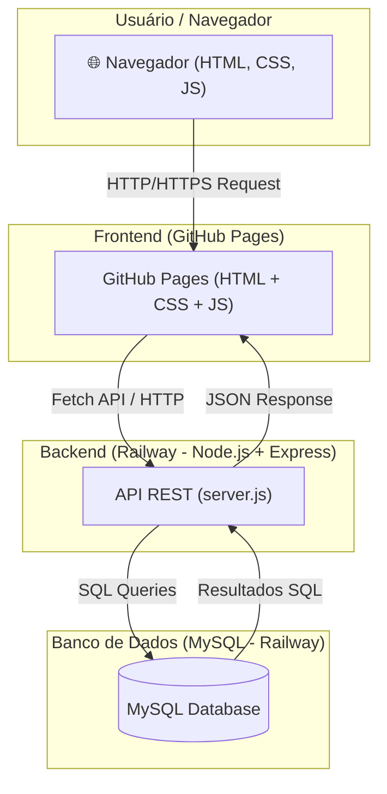
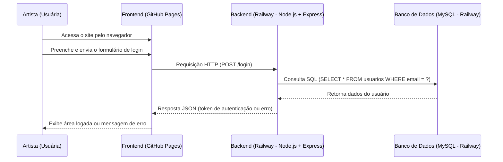
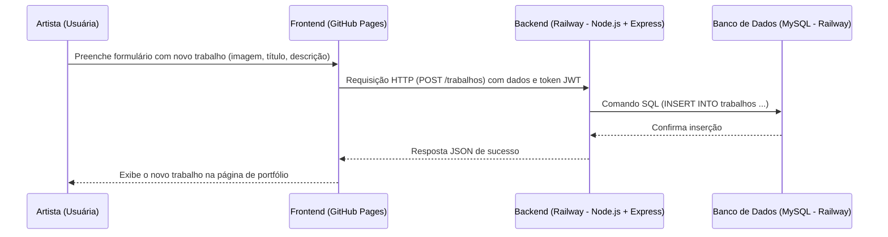

# 🎨 Projeto Gaby Essennce  

- Site/portfólio da artista freelancer Gaby. Permite que ela publique suas artes, organize e acompanhe pedidos, além de gerenciar o fluxo de trabalho.  
- Usuários podem navegar pelo portfólio, ver detalhes das obras e entrar em contato pelo WhatsApp.
 
## 🚀 Tecnologias Utilizadas
- **Frontend:** HTML, CSS, JavaScript  
- **Backend:** Node.js + Express  
- **Banco de Dados:** MySQL  
- **Hospedagem:**  
  - **Frontend:** [GitHub Pages](https://seu-usuario.github.io/seu-repo/)  
  - **Backend & DB:** [Railway](https://seu-backend.up.railway.app) 
    
- Site: [Gaby - Essennce-teste](https://lara-fernanda-silva-andrade.github.io/gaby-essennce-testes/)


## 📊 Arquitetura



## 📂 Estrutura do Projeto
- /frontend → Código do site (HTML, CSS, JS)
- /backend → API em Node.js + Express
    - /backend/js/server.js → Ponto de entrada
    - /backend/js/db.js → Conexão com o banco
    - /backend/js/controllers.js → Lógica da aplicação
    - /backend/sql → Scripts SQL para criação de tabelas

## 🔐 Diagrama de Sequência – Fluxo de Login

## 🎨 Diagrama de Sequência – Fluxo de Postagem de Trabalhos

## 💻 Executando Localmente

### 1. Clonar o repositório
```
git clone https://github.com/FarestWindow98/gaby-essennce.git
cd gaby-essennce

```
### 2. Configurar Backend
```
cd backend
npm install
```

- Instala as dependencias do `package.json` na pasta `backend/`.
### 3. Criar arquivo .env (Exemplo)

```
DB_HOST=localhost
DB_PORT=3306
DB_USER=root
DB_PASSWORD=senha123
DB_NAME=noticias

PORT=3000
```

### 4. Rodar o servidor

```
npm start
ou
node --require dotenv/config js/server.js
```
### A API estará disponível em:

    > http://localhost:3000


## 🌍 Deploy em Produção

### 🔑 Variáveis de Ambiente

No Railway, configure as seguintes variáveis:

- DB_HOST
- DB_PORT
- DB_USER
- DB_PASSWORD
- DB_NAME
- PORT

## 📈 Roadmap / Melhorias Futuras

- Página do usuário (perfil, configurações, histórico)
- Página de pedidos com formulário (para novos pedidos de trabalhos personalizados)
- Página de acompanhamento de pedido do usuário (status e atualizações)
- Sistema de notificações (por email ou dentro do site para avisar sobre novos pedidos, aprovações, etc)
- Melhorias de segurança (rate limiting, validação mais forte, proteção contra ataques)
- Sistema de pagamento online para pedidos pagos (Pix, cartão, PayPal)
- Dashboard com estatísticas sobre visitas, pedidos, trabalhos mais populares


## 🧩 Extenssões Usadas

- `Material Icon Theme` - Tema dos arquivos de das pastas.
- `Live Server` - Hospedar o projeto no localhost.
- `Live Preview` - Possibilita a pré-visualização do arquivo HTML.
- `Code Runner` - Executa o arquivo js no terminal.

## ✍️ Atalhos HMTL Semântico

- `.<nome>` - Cria uma div genérica com a classe "nome".
- `section.<nome>` - Cria uma section com a classe "nome".
- `section#<nome>` - Cria uma section com o id "nome".
- `section.<nome1>#<nome2>` - Cria uma section com classe "nome1" e id "nome2".

## ✍️ Atalhos VSCode

- `(Alt + Shift + i)` - Habilita edição em todas as linhas selecionadas.
- `(Ctrl + F2)` - Seleciona e habilita edição em todas as ocorrências de mesma sequência do conteudo selecionado.
- `(Ctrl + ;)` - Comenta o conteúdo selecionado.
- `(Alt + Z)` - Quebra de linha.

## 🌐Referências de Desenvolvimento

- https://developer.mozilla.org/pt-BR/
- https://www.w3schools.com/

## 🔧🐙 Git Config Utils

- git config --global user.email "you@example.com"
- git config --global user.name "Your Name"


