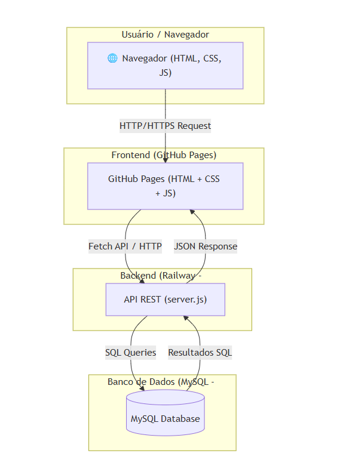

🎨 Projeto Gaby Essence  
---
- Site/portfólio da artista freelancer Gaby. Permite que ela publique suas artes, organize e acompanhe pedidos, além de gerenciar o fluxo de trabalho.  
- Usuários podem navegar pelo portfólio, ver detalhes das obras e enviar solicitações de pedidos através de um formulário simples.  
 
🚀 Tecnologias Utilizadas
---
- Frontend: HTML, CSS, JavaScript
- Backend: Node.js + Express
- Banco de Dados: MySQL
- Hospedagem:
  - Frontend: Páginas do GitHub
  - Backend e BD: Ferrovia
    
- Site: [Gaby - Essennce](https://farestwindow98.github.io/gaby-essennce/frontend/html/index.html)

📊 Arquitetura
  ---
  

 📂 Estrutura do Projeto
  ---
- /frontend → Código do site (HTML, CSS, JS)
- /backend → API em Node.js + Express
  - /backend/js/server.js → Ponto de entrada
  - /backend/js/db.js → Conexão com o banco
  - /backend/js/controllers.js → Lógica de aplicação
  - /backend/sql → Scripts SQL para criação de tabelas

🔄 Diagrama de Sequência – Fluxo de Requisição
---

